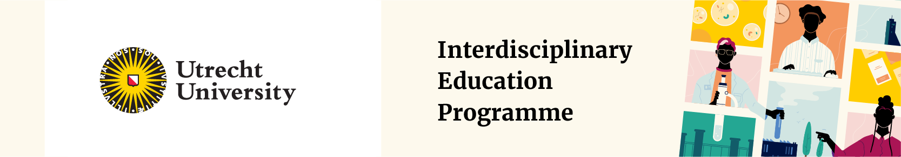

---
menus:
  main:
    weight: 5
title: About
weight: 1
params: 
  id: about-home
  title_img: "about_title.png"
  emoji: 🧑‍🏫
  icon: '<i class="bi-file-person-fill"></i>'
  teaser: 'Learn about this class!'
  md-title: '**About** this website'
---

This page contains the material for the course [Logical methods for
AI](https://osiris-student.uu.nl/onderwijscatalogus/extern/cursus?cursuscode=KI1V24001&taal=nl&collegejaar=2024)
as taught at [Utrecht
University](https://www.uu.nl/bachelors/kunstmatige-intelligentie").

##### Course description

Artificial intelligence (AI) aims to understand, artificially replicate, and
possibly improve intelligent behavior. In this course, you will learn about the
role that logic plays in this pursuit. Logic is the study of correct reasoning:
what constitutes good and bad inferences. Because reasoning is a fundamental
aspect of intelligent behavior, logic is a core subject in AI research. You
will learn how the methods of modern logic have influenced the development of
AI as a discipline and the role they play in current and cutting-edge AI
research, for example in the context of recent developments surrounding GenAI.

This course teaches you the logical foundations of AI research. At the end, you
will be able to:
+ identify the applications of logic within AI,
+ explain the strengths and weaknesses of logic within AI,
+ represent knowledge using logical formulas,
+ apply algorithms for automated reasoning, and
+ evaluate inferences in AI contexts for validity.

The material is intended for students taking the course at Utrecht University,
but it's freely available to anyone interested.

##### 

  This is , our friendly course mascot.

#####  Details



  

    <a href="https://jkorbmacher.org" class="list-group-item list-group-item-action d-flex gap-3 py-3" target="_blank">
      <i class="bi bi-person-circle"></i>
      

        

          <h6 class="mb-0">Maintainer</h6>
          

            The website is developed and maintained by Johannes Korbmacher.
          

        

      

    </a>

    <a href="https://logicalmethods.ai" class="list-group-item list-group-item-action d-flex gap-3 py-3" target="_blank">
      <i class="bi bi-person-hearts"></i>
      

        

          <h6 class="mb-0">Contributors</h6>
          

            This project has a growing list of contributors. 
          

        

      

    </a>

    <a href="https://gohugo.io/" class="list-group-item list-group-item-action d-flex gap-3 py-3" target="_blank">
      <i class="bi bi-hexagon"></i>
      

        

          <h6 class="mb-0">Hosting</h6>
          
The website is build with Hugo.

        

      

    </a>

    <a href="https://github.com/jkorb/logicalmethods.ai" class="list-group-item list-group-item-action d-flex gap-3 py-3" target="_blank">
      <i class="bi bi-github"></i>
      

        

          <h6 class="mb-0">Hosting</h6>
          
The website is hosted on GitHub pages.

        

      

    </a>

    <a href="https://creativecommons.org/licenses/by/4.0/deed.en" class="list-group-item list-group-item-action d-flex gap-3 py-3" target="_blank">
      <i class="bi bi-universal-access-circle"></i>
      

        

          <h6 class="mb-0">Content license</h6>
          
 The content of the website (the "course") is licensed under CC BY 4.0.

        

      

    </a>
    <a href="https://opensource.org/license/mit" class="list-group-item list-group-item-action d-flex gap-3 py-3" target="_blank">
      <i class="bi bi-code-slash"></i>
      

        

          <h6 class="mb-0">Software license</h6>
          
 The code of the website is licensed under the MIT license.

        

      

    </a>
    <a href="https://gdpr.eu/what-is-gdpr/" class="list-group-item list-group-item-action d-flex gap-3 py-3" target="_blank">
      <i class="bi bi-activity"></i>
      

        

          <h6 class="mb-0">GDPR</h6>
          
I neither collect nor store your data.
            Period.

        

      

    </a>
  





<h6>Sponsors</h6>
  

    This page and course has been made possible by the support of:
  

  

    Utrecht University's 
      <a href="https://www.uu.nl/en/education/interdisciplinary-education" target="_blank">
      Interdisciplinary Education Programe 
      </a>
  

  
  

    Utrecht University's focus area
      <a href="https://www.uu.nl/en/research/human-centered-artificial-intelligence" target="_blank">
      Human-centered Artificial Intelligence
      </a>
  

  

    NB: Even though the I use the website in my course, and it has been partially
    funded by the university, the website has no official ties to Utrecht
    University and is neither reviewed, approved, or the like by the
    university. 
  



